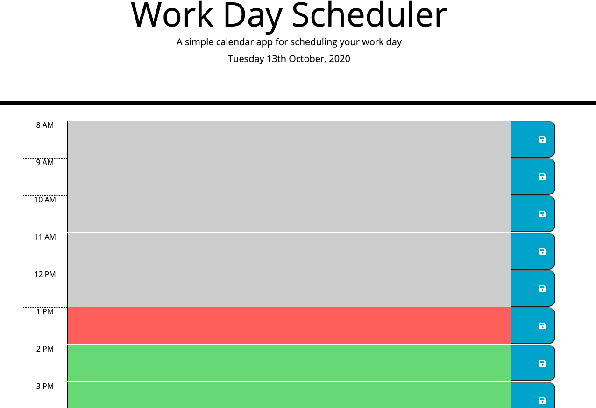

# Work_day_scheduler

Work day scheduler is an application which allows you to schedule your workday out. This application also has a functionality which will change colors based on time. If present, color is red, if past gray and if future green. This application allows user to add, remove and update apointments and schedule. The save button will save any changes made by user. 

